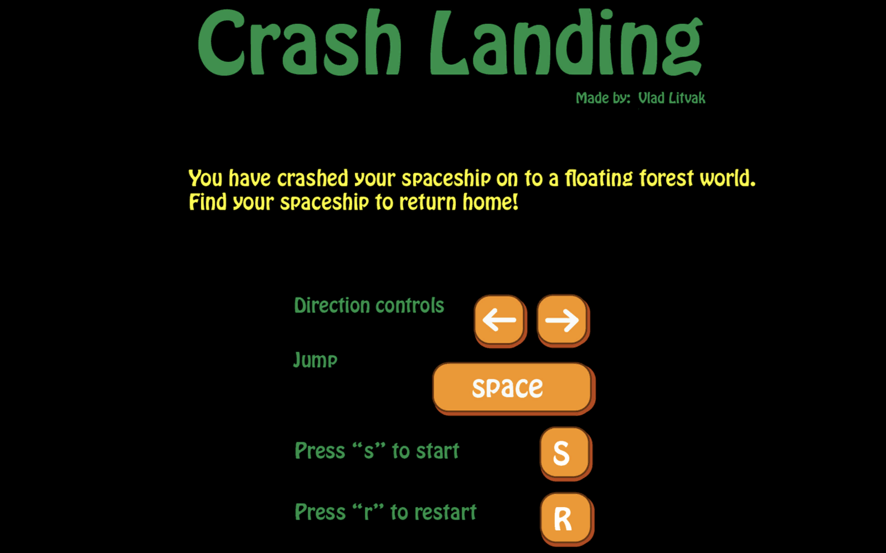
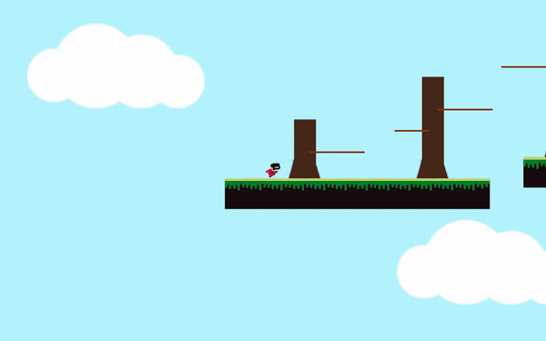
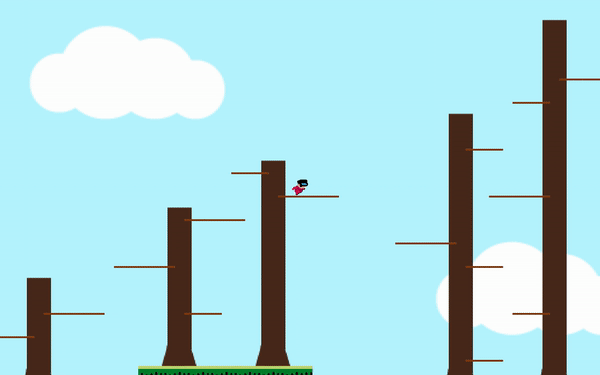

# Unity Platformer Game

### [See Demos](#start-screen)

### DESCRIPTION

- This is a platformer game created in the Unity game engine.
- Players scale tree branches and jump between floating islands to reach their crashed spaceship, while avoiding falling off the floating islands.
 

### FILE INFO

- [**Player.cs**](Player.cs) defines physics for player movement and registers win and loss conditions.
- [**StartScreen.cs**](StartScreen.cs) provides scene management for when a player is in the main menu, has won, or has died.
- [**CameraMovement.cs**](CameraMovement.cs) controls camera movement.
 

### TO PLAY (only for MacOS)
- Download and unzip [**Crash Landing Mac.zip**](Crash%20Landing%20Mac.zip).
- Run the application inside.
 
 

   
  <h2>Start Screen</h2>
  
   
   
  <h2>Gameplay</h2>
  
   
   
  <h2>Player Dies</h2>
  
   
   
  <h2>Player Wins</h2>
  

